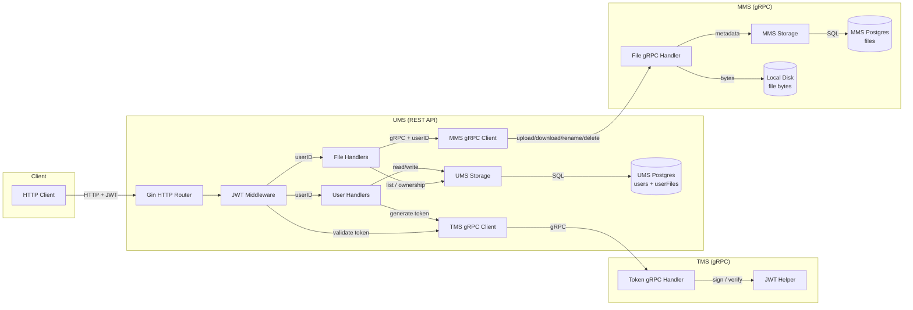

# Architecture

## Overview

The system is composed of three independent Go services under sibling folders:

- **UMS** (User Management Service) — public REST API (Gin) for user and file operations.
- **MMS** (Media Management Service) — gRPC service that stores file metadata and raw bytes.
- **TMS** (Token Management Service) — gRPC service that issues and validates HS256 JWTs.

UMS is the only service clients talk to directly. UMS calls MMS and TMS over gRPC. There is no direct MMS↔TMS communication.

## Service Layers

None of the three services has a separate service/domain layer between handlers and storage/helpers:

- **UMS**: HTTP handlers call `storage.UserService` / `storage.UserFilesService` directly. Cross-service orchestration and rollback logic live in the `grpcClient` package.
- **MMS**: gRPC handlers call `storage.FileService` directly and perform local filesystem operations themselves.
- **TMS**: gRPC handlers call the JWT helper directly; there is no storage layer.

## Data Flow



## Flow Description

1. The **Client** sends an HTTP request to **UMS Gin HTTP Router** with a JWT in the `Authorization` header for protected routes.
2. The **JWT Middleware** validates the token by calling **TMS** through the **TMS gRPC Client**.
3. The **TMS Token gRPC Handler** uses the **JWT Helper** to sign or verify HS256 tokens.
4. After validation, the middleware stores the `userID` in the Gin context and forwards the request to the handler.
5. **User Handlers** read/write user data through **UMS Storage** to **UMS Postgres**. They call **TMS** to generate a token during login.
6. **File Handlers** manage user-file mappings through **UMS Storage** to **UMS Postgres**, and forward file operations to **MMS** through the **MMS gRPC Client**.
7. The **MMS File gRPC Handler** stores metadata via **MMS Storage** to **MMS Postgres** and reads/writes raw file bytes to **Local Disk**.

## UMS Route Structure

Base prefix: `/api/users`

```
POST   /register                 → public
POST   /login                    → public
GET    /profile                  → auth
PATCH  /update                   → auth

POST   /files/upload             → auth
GET    /files/:fileid/download   → auth
GET    /files                    → auth   (list)
PATCH  /files/:fileid/rename    → auth
DELETE /files/:fileid            → auth
```

`userID` is never in the URL path; it is taken from the JWT claims stored in the Gin context by the auth middleware.

## Databases and Storage

- **UMS Postgres** (`cloud_ums`): stores `users` and `userFiles` mapping tables.
- **MMS Postgres** (`cloud_mms`): stores the `files` metadata table.
- **MMS Local Disk**: actual file bytes under `USER_STORAGE_PATH/<userID>/<fileName>`.
- **TMS**: no database; uses the `JWT_SECRET` environment variable only.
